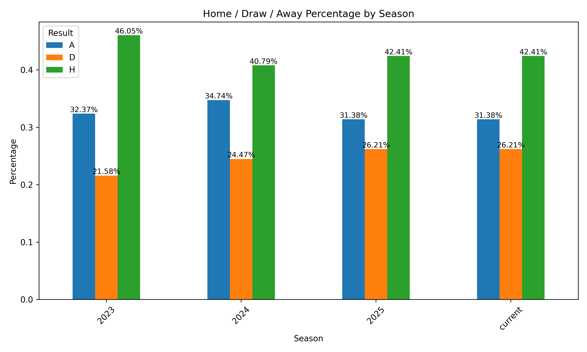
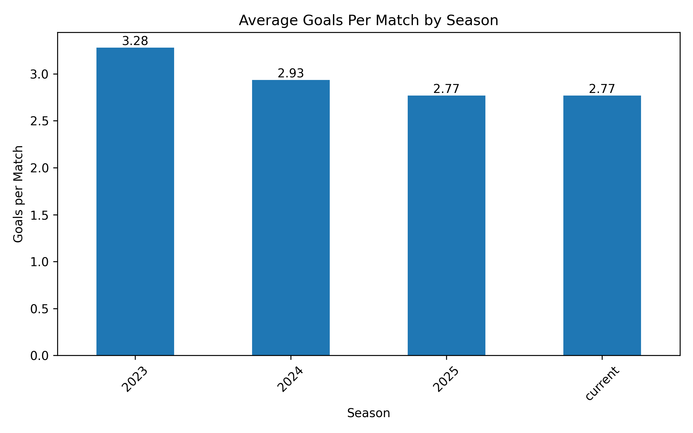
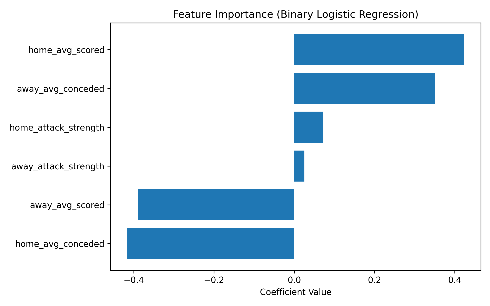

⚽ Premier League Multi-Season Analytics & Match Prediction

End-to-end football analytics project using API data, rolling feature engineering, and predictive modelling.

This project explores Premier League match data across multiple seasons to understand performance trends and build models that attempt to predict match outcomes.

The goal of the project was to understand:

How team form affects match results

Whether recent performance metrics can help predict outcomes

How accurate simple statistical models can be when applied to football data

📊 Exploratory Data Analysis

Before building predictive models, the first step was to understand patterns in the data.

Home / Draw / Away Distribution

This chart shows how match results are distributed across seasons.

What this shows

Home wins consistently represent the largest share of results

Away wins fluctuate depending on season competitiveness

Draw frequency increased slightly in more recent seasons

This confirms the well-known home advantage effect in football.

Average Goals Per Match

Observations

Goal scoring decreased over the seasons analysed:

Season	Avg Goals
2023	3.28
2024	2.93
2025	2.79

This suggests matches are becoming more defensively balanced.

🤖 Predictive Modelling

After analysing trends, the next goal was to determine whether recent team performance could predict match outcomes.

The challenge in sports prediction is that football matches contain a lot of randomness.

Instead of predicting final scores, we focused on predicting match outcomes.

Feature Engineering

To simulate pre-match prediction, we created rolling statistics based on previous matches.

Key features include:

home_avg_scored
home_avg_conceded
away_avg_scored
away_avg_conceded

These were calculated using rolling averages from previous matches.

Example concept used in the code:

finished.groupby("home_team")["ft_home"].transform(
    lambda x: x.shift().rolling(5).mean()
)

The shift() operation prevents data leakage, ensuring the model only uses information available before the match occurs.

Binary Model Feature Importance

Interpretation

The most important predictors of a home win were:

Positive impact

High recent home team scoring

High away team goals conceded

Negative impact

High home team goals conceded

High away team scoring form

This aligns well with football intuition.

Teams that score more and concede less tend to win more matches.

📈 Model Performance
Model	Accuracy
Logistic Regression (3-class)	42.9%
Balanced Logistic Regression	41.7%
Random Forest	39.8%
Binary Logistic Regression	62.5%

Binary prediction simplified the problem and produced stronger results.

🧠 What I Wanted To Understand

This project was created to explore several questions:

Can simple statistical features capture team strength and form?

How predictable are football match outcomes?

Can rolling performance metrics provide predictive signal?

The results suggest that while football remains difficult to predict, recent team performance contains useful information, especially when predicting home wins vs non-home wins.

⚙ Technologies Used

Python

pandas

matplotlib

scikit-learn

requests

Jupyter Notebook

VS Code

Git / GitHub

🚀 Future Improvements

Potential extensions include:

Adding betting odds as predictive features

Incorporating Elo ratings

Using gradient boosting models

Building a dashboard for interactive exploration

🏁 Conclusion

This project demonstrates a full data science workflow applied to sports analytics, from data extraction and cleaning to predictive modelling.

Although football outcomes remain highly uncertain, rolling performance metrics can provide meaningful predictive insight, particularly for forecasting home wins.